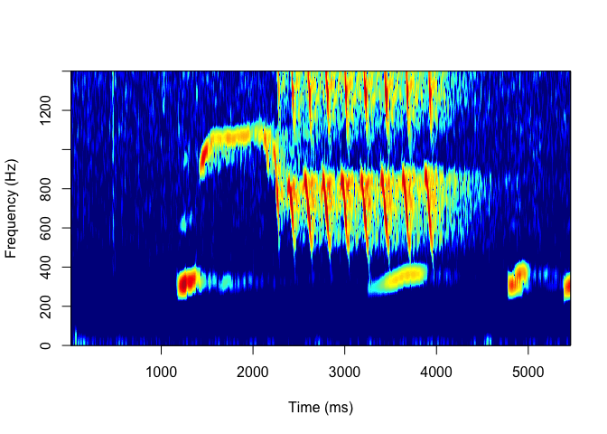
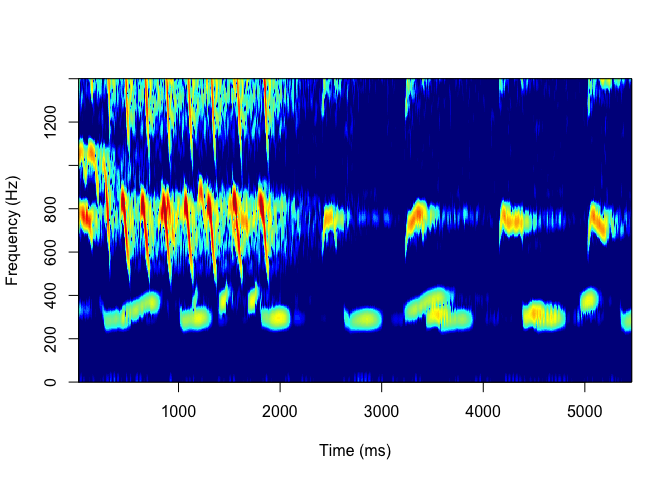

<!-- README.md is generated from README.Rmd. Please edit that file -->

# Siamang-vocal-variation

<!-- badges: start -->
<!-- badges: end -->

This is the repository for: Evidence for
vocal flexibility in wild siamang (*Symphalangus syndactylus*) ululating
scream phrases.

Please cite as: 

D’Agostino, J., Spehar, S., Abdullah, A., and Clink, D.J. Evidence for Vocal Flexibility in Wild Siamang (Symphalangus syndactylus) Ululating Scream Phrases. Int J Primatol (2023). https://doi.org/10.1007/s10764-023-00384-5

``` r
us2wav <- tuneR::readWave("/Users/denaclink/Desktop/RStudio Projects/Siamang-vocal-variation/Sound Files/US2.wav")
us2wav <- seewave::cutw(us2wav,from=2.5,to=8,output = 'Wave')

phonTools::spectrogram(us2wav@left,windowlength = 35,fs =44100, 
                       maxfreq = 1400)
```

<!-- -->

``` r
greatcallwav <- tuneR::readWave("/Users/denaclink/Desktop/RStudio Projects/Siamang-vocal-variation/Sound Files/GreatCall.wav")
greatcallwav <- seewave::cutw(greatcallwav,from=2.5,to=8,output = 'Wave')

phonTools::spectrogram(greatcallwav@left,windowlength = 35,fs =44100, 
                       maxfreq = 1400)
```

<!-- -->
